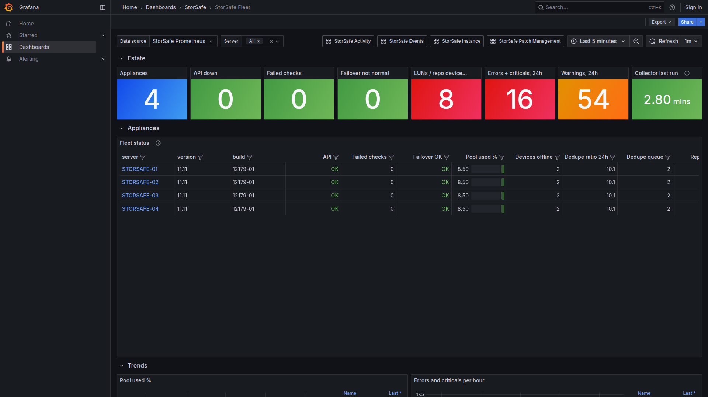
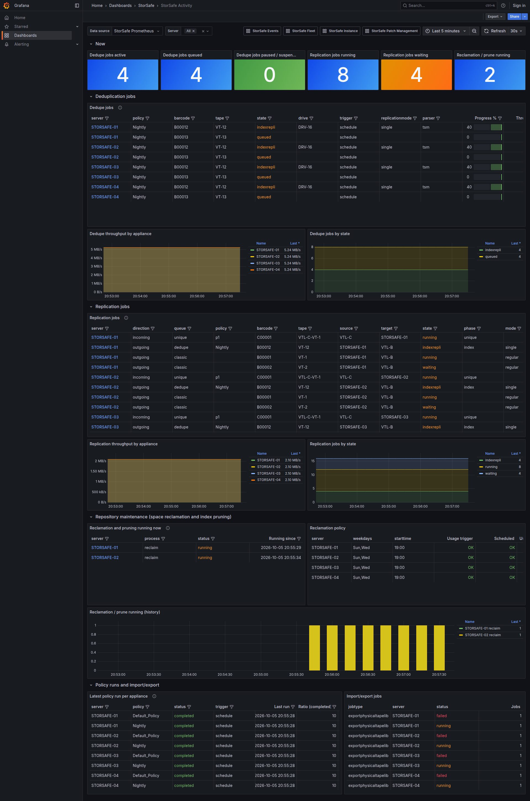
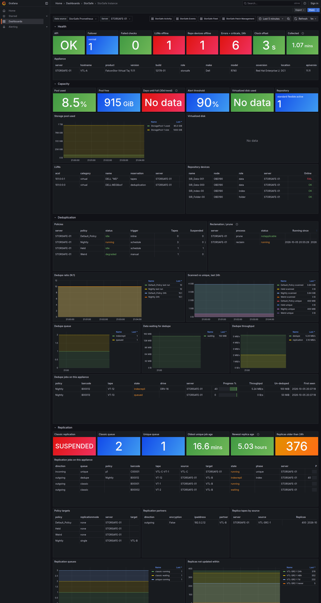
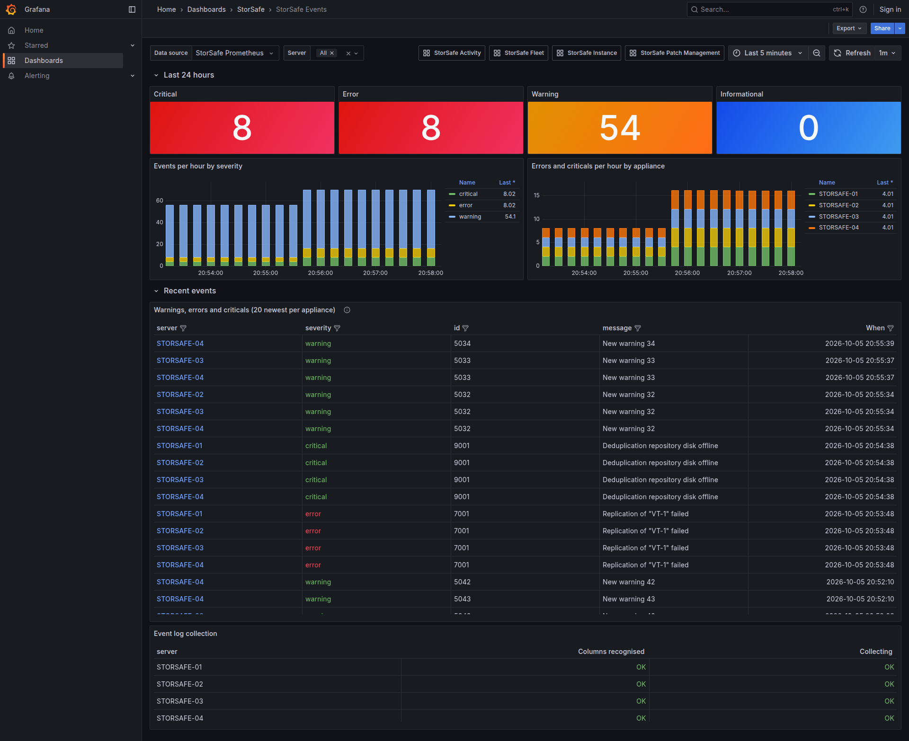
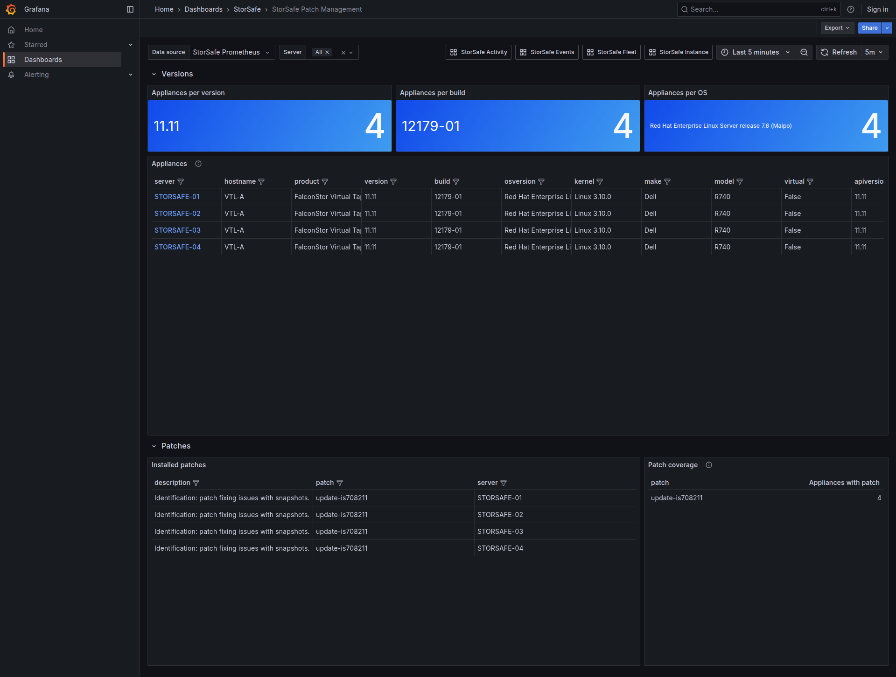
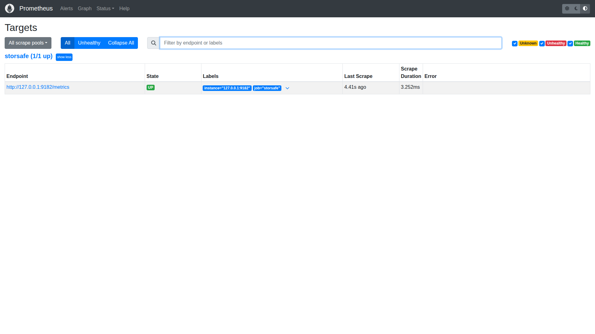
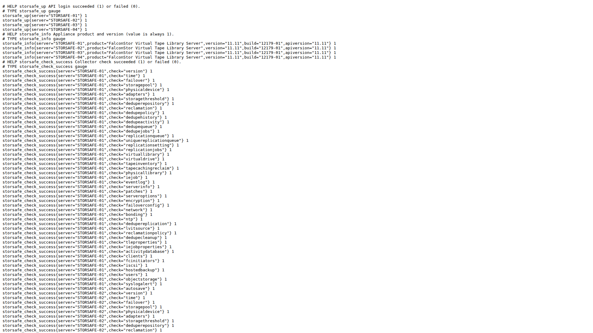

# StorSafe Monitoring

A self-contained package that monitors FalconStor StorSafe (VTL and deduplication) appliances using a PowerShell collector, windows_exporter, Prometheus and Grafana, all on one Windows host. The same stack also runs on one Linux host, with node_exporter in place of windows_exporter (see [Install on a Linux machine](#install-on-a-linux-machine)). It talks to the appliances' REST API only; nothing is installed on them. Not affiliated with FalconStor. Every StorSafe API call it makes is read-only: GETs, plus login/logout, plus one `PUT /server/event` that only downloads the event log as CSV and changes nothing.

```
StorSafe API --(Export-StorSafeMetrics.ps1, every 5 min)--> metrics\storsafe.prom  (metrics/storsafe.prom on Linux)
   --> windows_exporter (Linux: node_exporter) :9182 --> Prometheus 127.0.0.1:9090 --> Grafana :3000 (dashboard + alerts)
```

## Screenshots

Rendered from the test kit's mock API (`tools\test`), so the appliance names are template names. Each dashboard links to the others from its top bar.

**Fleet**: one row per appliance with API state, failed checks, failover, pool usage, device faults, dedupe and replication at a glance.



**Activity**: running dedupe, replication, reclamation and prune jobs across the estate, with throughput and queue trends.



**Instance**: one appliance (server picker, one URL per appliance): health, capacity, LUNs and repository devices, deduplication, replication and the collector itself.



**Events**: event-log counts by severity, per-hour trends and the newest warnings, errors and criticals per appliance.



**Patch Management**: versions, builds, OS and installed patches across the estate.



**Prometheus and the exporter**: the collector writes `metrics\storsafe.prom`, windows_exporter serves it on port 9182, and Prometheus scrapes it as job `storsafe`. These two pages are the first place to look when a dashboard is empty.





More: the [full-height Fleet page](docs/images/grafana-fleet.png), the [Grafana dashboard folder](docs/images/grafana-folder.png) and the [Prometheus graph page](docs/images/prometheus-graph.png).

## Layout

| Path | Contents |
|---|---|
| `VERSION`, `CHANGELOG.md` | Package version and what changed between versions |
| `Install-StorSafeMonitoring.ps1` | One-shot installer (idempotent, safe to re-run) |
| `Get-StorSafeInstallers.ps1` | Downloads the three third-party installers into `installers\` |
| `StorSafeMonitoringControl.ps1` | Status / Stop / Start / Pause / Resume of the whole stack, for maintenance |
| `linux\install.sh` | One-shot Linux installer (idempotent, safe to re-run; `--help` lists its options) |
| `linux\get-installers.sh` | Downloads the four third-party tarballs into `installers\` (`--print-urls` for a host with no internet access) |
| `linux\storsafe-control.sh` | status / stop / start / pause / resume of the whole stack on Linux, for maintenance |
| `linux\systemd\` | Unit and timer templates that `install.sh` renders into `/etc/systemd/system` |
| `linux\lib.sh` | Functions shared by the Linux scripts (not run by itself) |
| `StorSafe.psm1` | Shared API client |
| `StorSafe.config.json` | Appliances and settings. **Edit the Servers list before installing.** |
| `Export-StorSafeMetrics.ps1` | Metrics collector (run by the scheduled task) |
| `Get-StorSafeActivity.ps1`, `Get-StorSafeLoadedTapes.ps1` | Ad-hoc CSV/console reports |
| `metrics\` | windows_exporter or node_exporter textfile directory (`storsafe.prom`, plus `storsafe-<server>.prom` per appliance in parallel mode) |
| `reports\` | CSV output of the Get-* scripts (30-day retention) |
| `creds\` | Credential files (created by the installer): DPAPI-protected on Windows, Export-Clixml files in a mode 0700 folder on Linux |
| `installers\` | Put the third-party installers here (see `installers\README.txt`) |
| `state\` | Collector state: event log bookmark/counters and cached hourly checks (safe to delete) |
| `events\` | Raw event log, one CSV per appliance per day (90-day retention) |
| `prometheus\` | Created at install: Prometheus binaries, config and data |
| `grafana\`, `node_exporter\` | Created at install on Linux: the extracted Grafana (with its data) and node_exporter |
| `monitoring\` | prometheus.yml, Grafana provisioning, dashboard JSON, task registration script |

Paths are written with backslashes, as on Windows; on Linux they are the same names with `/`.

## Install on a new Windows machine

What you need:

- Windows 10/11 or Windows Server 2016 or later, 64-bit, with Windows PowerShell 5.1 (built in). About 2 GB of disk for the stack plus Prometheus data (roughly 50 MB per appliance per month at the default 180-day retention).
- A local Administrator account for the install, and the account the collector will run as (it can be the same one; the installer asks for its password so the scheduled task runs while logged off).
- Network access from this machine to every appliance on the API port (https 443 by default) and, for the installer download step only, to github.com and grafana.com (or the three installer files copied in by hand).
- For each appliance, an API account. A read-only (type R) account is recommended.

Steps, from an elevated cmd prompt (right-click Command Prompt > Run as administrator), logged on as the account that will run the collector:

1. Extract the release zip and copy the `StorSafeMonitoring` folder to a path **without spaces**, e.g. `C:\StorSafeMonitoring` (or, with git on the machine, `git clone https://github.com/triippiing/storsafe-monitoring.git C:\StorSafeMonitoring`; the checkout is the package). The windows_exporter MSI can't handle spaces in the metrics path, so the installer refuses to run from such a folder.
2. Get the third-party installers into `installers\`:
   ```
   powershell.exe -NoProfile -ExecutionPolicy Bypass -File C:\StorSafeMonitoring\Get-StorSafeInstallers.ps1
   ```
   (add `-Proxy http://proxy:port` if the machine needs one; with no internet access, download the three URLs it prints on another machine and copy the files in).
3. Copy `StorSafe.config.example.json` to `StorSafe.config.json` (the installer does this for you if the file is missing, then stops so you can edit it) and fill in the `Servers` list: a name, IP or hostname, and credential file name per appliance. Under `Defaults`, check `Scheme` and `SkipCertificateCheck` (true for self-signed appliance certificates). The example shows every setting; the real file is ignored by git.
4. Run the installer:
   ```
   powershell.exe -NoProfile -ExecutionPolicy Bypass -File C:\StorSafeMonitoring\Install-StorSafeMonitoring.ps1
   ```
   It prompts for each appliance's API account, then for the collector account's Windows password. It then installs windows_exporter, Prometheus (as a startup task), Grafana (with the data source and dashboards provisioned) and the collector task, runs the collector once, and prints a summary table. Every step is idempotent: if a step reports a missing installer, add the file and re-run.
5. Check it:
   ```
   powershell.exe -NoProfile -ExecutionPolicy Bypass -File C:\StorSafeMonitoring\StorSafeMonitoringControl.ps1 Status
   ```
   All four components should show Running/Ready and answering. Then open http://localhost:3000 (first login admin/admin, you are asked to change it) and go to **Dashboards > StorSafe**:

- **StorSafe Fleet**: one row per appliance (API up, failed checks, pool used, offline devices, queues, events, replica age), red rows at the top. Click a server name to open its Instance page.
- **StorSafe Activity**: live job tables across the estate: dedupe jobs (server, policy, barcode, state, drive, progress, first seen), replication jobs (source, target, phase, progress), reclamation/prune runs in progress, latest policy run per appliance, import/export.
- **StorSafe Instance**: everything for one appliance, chosen from the Server picker (health, capacity, deduplication, replication, tapes, events, platform, collector). Each appliance has its own URL: `/d/storsafe-instance?var-server=NAME`.
- **StorSafe Patch Management**: product version, build and patch level, installed patches and patch coverage, RHEL release, kernel, make/model, memory, clock offset.
- **StorSafe Events**: warnings, errors and criticals across the estate, with counts over time and a filterable table.

The dashboards are file-provisioned from `monitoring\dashboards\`; deleting a JSON file there removes that dashboard from Grafana.

Ports: Grafana 3000 (all interfaces; put it behind the Windows firewall or bind it to 127.0.0.1 in Grafana's `conf\custom.ini` if only local use is wanted), Prometheus 9090 and windows_exporter 9182 (127.0.0.1 only, nothing to open). Everything restarts by itself after a reboot.

Adding an appliance later: add it to `Servers` in the config, then create its credential file as the collector account:

```
powershell.exe -NoProfile -ExecutionPolicy Bypass -Command "Import-Module C:\StorSafeMonitoring\StorSafe.psm1; New-StorSafeCredentialFile -Path C:\StorSafeMonitoring\creds\NEWNAME.xml"
```

The next collector run picks it up; the Fleet, Activity and Patch pages show it automatically and it appears in the Instance page's server picker.

## Install on a Linux machine

The same package on one Linux host: the collector runs under PowerShell 7 from a systemd timer, node_exporter serves the textfile metrics, and Prometheus and Grafana run as systemd services, all out of the install folder. The collector, the metrics and the dashboards are the same as on Windows.

What you need:

- 64-bit (x86_64) Linux with systemd: RHEL family 8 or 9 (RHEL, Rocky Linux, AlmaLinux), Debian 12, or an Ubuntu LTS release. About 2 GB of disk for the stack plus Prometheus data (roughly 50 MB per appliance per month at the default 180-day retention).
- Root through sudo. The installer creates a system account, `storsafe`, and the collector and every service run as it, so unlike the Windows install you do not log on as the collector account.
- `curl`, `tar` and `gzip` (the installer checks for them), and the ICU library that PowerShell needs if the host does not have it yet: `dnf install libicu` on the RHEL family, `apt-get install libicu72` on Debian 12, `apt-get install libicu74` on Ubuntu 24.04 (other Debian-family releases: `apt-cache search --names-only '^libicu[0-9]+$'` finds the package name). The installer stops with this hint when `pwsh` does not start.
- PowerShell 7: the installer uses a `pwsh` that is already on the PATH, otherwise it unpacks the PowerShell tarball (7.6.6, the LTS line; PowerShell 7.4 reaches end of support on 2026-11-10).
- Network access from this machine to every appliance on the API port (https 443 by default) and, for the download step only, to github.com and dl.grafana.com (or the four tarballs copied in by hand).
- For each appliance, an API account. A read-only (type R) account is recommended.

Steps, from a shell on the host. Commands that need root start with `sudo`; the ones after step 1 run from the install folder (`cd /opt/storsafe-monitoring`):

1. Put the package in `/opt/storsafe-monitoring`, a path **without spaces** (the installer refuses one). With git on the machine, the clone is the package:
   ```
   sudo git clone https://github.com/triippiing/storsafe-monitoring.git /opt/storsafe-monitoring
   ```
   Otherwise extract the release tarball; it unpacks into a `StorSafeMonitoring` folder, hence `--strip-components=1`:
   ```
   sudo mkdir -p /opt/storsafe-monitoring
   sudo tar -xzf StorSafe-monitoring-v<ver>.tar.gz --strip-components=1 -C /opt/storsafe-monitoring
   ```
   The scripts are executable in the clone and in the tarball. To install somewhere else, give `--root DIR` to every installer run (this section assumes the default).
2. Get the third-party tarballs into `installers/`:
   ```
   sudo linux/get-installers.sh
   ```
   It downloads node_exporter 1.12.1, Prometheus 3.15.0, Grafana 12.0.2 and PowerShell 7.6.6, and keeps files that are already there (`--force` downloads again, `--dest DIR` picks another folder, `--node-exporter-version`, `--prometheus-version`, `--grafana-version` and `--powershell-version` pick other versions). curl takes its proxy from the environment, and sudo drops that, so with a proxy run `sudo env https_proxy=http://proxy:port linux/get-installers.sh`. With no internet access, `linux/get-installers.sh --print-urls` prints the four URLs: download them on another machine and copy the files into `installers/`.
3. Create `StorSafe.config.json` from `StorSafe.config.example.json` (the installer does this for you if the file is missing, then stops so you can edit it) and fill in the `Servers` list as in step 3 of the Windows install: a name, IP or hostname, and credential file name per appliance, and under `Defaults` the `Scheme` and `SkipCertificateCheck` settings. The example's `creds\storsafe-01.xml` paths work on Linux as written (`creds/storsafe-01.xml` is the same file).
   ```
   sudo cp StorSafe.config.example.json StorSafe.config.json
   ```
   Then edit the new file as root: `sudoedit StorSafe.config.json` (or `sudo nano StorSafe.config.json`).
4. Run the installer:
   ```
   sudo linux/install.sh
   ```
   It installs PowerShell if `pwsh` is missing, creates the `storsafe` service account, makes the package readable by it, prompts for each appliance's API account that has no credential file yet, runs the collector once as a test, then installs node_exporter, Prometheus and Grafana (with the data source and dashboards provisioned), the systemd units and the collector timer, and prints a summary table (OK, Skipped, Missing installer or Check per step) and what to do next. Every step is idempotent: if a step reports a missing installer or a check, fix it and re-run. The exit status is 0 when no row is Check or Missing installer.
5. Check it:
   ```
   linux/storsafe-control.sh status
   ```
   The collector timer should be active with a next run, and node_exporter, Prometheus and Grafana should show "answering on" their ports (the collector service itself only runs for the length of one collection, so it normally shows inactive between runs). Then look at the three pages:
   - http://127.0.0.1:9182/metrics (node_exporter): the `storsafe_` series are in the list.
   - http://127.0.0.1:9090/targets (Prometheus): job `storsafe` is UP.
   - http://127.0.0.1:3000 (Grafana; from another machine use the host's name instead of 127.0.0.1): first login admin/admin, you are asked to change it. Then go to **Dashboards > StorSafe**: the five dashboards are the ones described under the Windows steps above.

The installer's steps:

| # | Step | What it does |
|---|---|---|
| 1 | Preconditions | Checks root, systemd, x86_64, curl, tar and gzip, and that the install folder holds the package; notes a port (9182, 9090, 3000) that something else already listens on |
| 2 | PowerShell | Uses the `pwsh` on the PATH, else unpacks the PowerShell tarball to `/opt/microsoft/powershell/7` and links `/usr/bin/pwsh`; stops with the ICU hint if `pwsh` does not start |
| 3 | Service user | Creates the `storsafe` system account (no login shell, the install folder as its home) and the folders it writes to: `creds/`, `state/`, `events/`, `metrics/`, `reports/` |
| 4 | Config | Creates `StorSafe.config.json` from the example if it is missing, then stops so you can edit it |
| 5 | Package permissions | Adds read permission for everyone over the install folder (`creds/` and the data folders excepted, nothing is ever taken away), so `storsafe` can read the package whatever root's umask was when it was unpacked; stops if a folder above the install folder still blocks it |
| 6 | Credentials | Prompts for each missing credential file and saves it as `storsafe` (see below) |
| 7 | Collector test | Runs the collector once as `storsafe` and reports the result |
| 8 | node_exporter, Prometheus, Grafana | Unpacks the newest tarball of each from `installers/` into `node_exporter/`, `prometheus/` and `grafana/` (a newer tarball there is an upgrade; `data/` is kept; the files stay root-owned, only `data/` belongs to `storsafe`), puts `monitoring/prometheus.yml` and the Grafana data source and dashboard provisioning in place |
| 9 | Units and services | Renders the unit files from `linux/systemd/` into `/etc/systemd/system`, enables and starts them (starting the collector's timer runs the collector straight away, then every 5 minutes or your `--interval-minutes`), restarts what changed, and waits for the three ports to answer; a unit whose component reported Missing installer or Check is left disabled and named in the Services row |

Switches (`linux/install.sh --help` lists them). Give the same ones again when you re-run the installer, because the unit files are rendered from them:
- `--root DIR`: the install folder, the folder that holds this package (default `/opt/storsafe-monitoring`, no spaces).
- `--user NAME`: the account that runs the collector and the services (default `storsafe`, created if missing).
- `--interval-minutes N` (1 to 60, default 5) and `--retention-days N` (1 to 3650, default 180).
- `--collector-only` and `--listen ADDR:PORT`: see the next paragraph.
- `--skip-credentials` if the credential files are already in place or will be made later.
- `--no-services` writes the files and prints the `systemctl` commands it would run, without needing systemd (for images and containers); `--unit-dir DIR` writes the unit files to another folder (default `/etc/systemd/system`).
- `--uninstall`: see Uninstall below.

**Collector only.** For a host that sends its metrics to a Prometheus and Grafana you already run elsewhere, add `--collector-only`. The installer then sets up PowerShell, the collector and node_exporter only, so it needs the node_exporter tarball (and the PowerShell one unless `pwsh` is installed already) but not Prometheus or Grafana:

```
sudo linux/install.sh --collector-only
```

node_exporter then listens on `0.0.0.0:9182` (`--listen ADDR:PORT` changes that) so that the Prometheus server can reach it. Allow port 9182 from that server in the host firewall:

```
sudo firewall-cmd --permanent --add-port=9182/tcp && sudo firewall-cmd --reload     # RHEL family
sudo ufw allow 9182/tcp                                                              # Debian, Ubuntu
```

Add this job to `scrape_configs` in that Prometheus's `prometheus.yml` and reload it (the installer prints it with this host's name when it finishes):

```yaml
  - job_name: storsafe
    static_configs:
      - targets: ['<this host>:9182']
    metric_relabel_configs:
      - source_labels: [__name__]
        regex: 'storsafe_.*|windows_textfile_.*|node_textfile_.*'
        action: keep
```

The `keep` rule is the one in `monitoring/prometheus.yml`: it keeps the StorSafe series and the textfile collector's own health metrics and nothing else from the host. Import the five dashboards, `monitoring/dashboards/*.json`, into that Grafana (Dashboards > New > Import) and choose your Prometheus in each dashboard's Data source box (they open on a data source with the uid `storsafe-prometheus`, which is the one the full-stack install provisions).

**Credentials on Linux.** There is no DPAPI on Linux: `New-StorSafeCredentialFile` saves the credential with Export-Clixml and the file is **not encrypted**. What protects it is file permissions: `creds/` is mode 0700 and each credential file 0600, owned by the service account `storsafe`, so only that account and root can read them. The installer prompts for each missing file (as `storsafe`; a file that several appliances share is asked for once) unless you pass `--skip-credentials`. Unlike a DPAPI file, one of these works on any machine it is copied to, so keep `creds/` out of backups that others can read.

Ports: Grafana 3000 (all interfaces; to reach it from other machines open the port in the host firewall, `sudo firewall-cmd --permanent --add-port=3000/tcp && sudo firewall-cmd --reload` or `sudo ufw allow 3000/tcp`), Prometheus 9090 and node_exporter 9182 (127.0.0.1 only, nothing to open; with `--collector-only` node_exporter is on all interfaces, as above). Everything restarts by itself after a reboot: the units are enabled, and the collector runs again shortly after boot.

**SELinux.** On a RHEL family host in enforcing mode this package needs no policy module: the binaries under `/opt` carry the `usr_t` file context and systemd runs them in the `unconfined_service_t` domain. A site with a stricter policy sees denials in `sudo ausearch -m AVC -ts recent` (add `-c pwsh`, `-c grafana`, `-c prometheus` or `-c node_exporter` to look at one program) and in the units' `journalctl`. That check is part of the maintainer's acceptance test on a RHEL host, not of CI.

Adding an appliance later: add it to `Servers` in the config, then re-run `sudo linux/install.sh` with your usual switches. It asks only for the credential files that are missing, and the next collector run picks the appliance up; the dashboards show it automatically.

## Upgrading an existing install

Read `CHANGELOG.md` for what changed, then copy the new files over the install folder, keeping your `StorSafe.config.json` and `creds\`. From an elevated cmd prompt, with the new zip extracted to `C:\Temp\StorSafeMonitoring`:

```
robocopy C:\Temp\StorSafeMonitoring C:\StorSafeMonitoring /E /XF StorSafe.config.json /XD creds
```

Upgrading from v4.x: the Estate and Detail dashboards are replaced by the five above, so delete their JSON files and Grafana drops them within a minute:

```
del C:\StorSafeMonitoring\monitoring\dashboards\storsafe-estate.json C:\StorSafeMonitoring\monitoring\dashboards\storsafe-detail.json
```

Nothing needs restarting. The next collector run picks up the new checks (run it by hand to see the output straight away), and Grafana loads the new dashboard within a minute.

**On Linux**, read `CHANGELOG.md` the same way, then unpack the new tarball over the install folder, keeping your config and credentials (the two `--exclude` options leave `StorSafe.config.json` and `creds/` alone, and `--no-overwrite-dir` keeps the owner and mode of the folders that already exist, such as `creds/` and `state/`, which belong to `storsafe`):

```
sudo tar -xzf StorSafe-monitoring-v<ver>.tar.gz --strip-components=1 --no-overwrite-dir -C /opt/storsafe-monitoring --exclude=StorSafe.config.json --exclude='creds/*'
```

or, for a git clone, `sudo git -C /opt/storsafe-monitoring pull`. Then re-run the installer with the same switches you installed with:

```
sudo /opt/storsafe-monitoring/linux/install.sh
```

It rewrites a unit file or a config only when it changed and restarts only the services that changed. A newer node_exporter, Prometheus or Grafana tarball in `installers/` is an upgrade too (`linux/get-installers.sh` with `--prometheus-version` and the like fetches one; Prometheus's and Grafana's `data/` are kept). Grafana loads new dashboards within a minute, and the next collector run picks up new checks.

## What the collector reads

Each check is independent: a failure shows as `storsafe_check_success{check="..."} 0` and the rest carry on.

| Cadence | Checks |
|---|---|
| Every run (5 min) | version, time, failover, storagepool, physicaldevice, adapters, storagethreshold, deduperepository, reclamation, dedupepolicy, dedupehistory, dedupeactivity, dedupequeue, dedupejobs, replicationqueue, uniquereplicationqueue, replicationsetting, replicationjobs, virtuallibrary, virtualdrive, tapecaching, physicallibrary, iejob, eventlog |
| Every 15 min | tapeinventory (pages through every virtual tape), tapecachingreclaim |
| Every 60 min | serverinfo, patches, serveroptions, encryption, failoverconfig, network, bonding, ntp, dedupereplication, lvitsource, reclamationpolicy, dedupecleanup, tleproperties, iejobproperties, activitydatabase, clients, fcinitiators, iscsi, hostedbackup, users, objectstorage, syslogalert, autosave |

The 15- and 60-minute checks are cached in `state\` and re-published on the runs in between. `-Refresh` ignores the cache.

Per-job detail (`dedupejobs`, `replicationjobs`) reads one API call per queued job, capped at 100 jobs per appliance per run. The API has no start time for a dedupe job, so the collector records when it first saw each job (`state\jobs-*.json`); reclamation and prune give only idle/running/failed, so the collector tracks their transitions (`state\maintenance-*.json`) to give each run a start, end and duration, accurate to one collector interval.

**Parallel collection.** With more than two appliances the collector runs one child process per appliance, up to `-MaxParallel` at a time (default: 1 for up to two appliances, otherwise one worker per four appliances, at most 8). Each appliance then writes its own `metrics\storsafe-<server>.prom` and `storsafe.prom` carries only the collector summary (`storsafe_collector_server_exit_code{server}`, `storsafe_collector_parallel_processes`, `storsafe_collector_run_duration_seconds`). `-MaxParallel 1` forces the single-process mode. The scheduled task needs no change; windows_exporter reads every `.prom` file in `metrics\`.

Optional settings under `Defaults` in `StorSafe.config.json`:

| Setting | Default | Meaning |
|---|---|---|
| `DisabledChecks` | `[]` | Checks to skip, e.g. `["tapecaching", "objectstorage"]` for features you don't use |
| `CollectEventLog` | `true` | Download new event log entries every run |
| `EventLogDirectory` | `events` | Where the raw daily CSVs go |
| `EventLogRetentionDays` | `90` | Older CSVs are deleted |
| `StateDirectory` | `state` | Collector state |

Not collected on purpose: SNMP settings (they include community strings and passwords), encryption keys, X-ray, failover preflight checks and device rescans (they make the appliance do work), user names, and the system variable list. Hardware sensors aren't in the API; use IPMI/iDRAC or SNMP for those.

The installer steps are:

| # | Step | What it does |
|---|---|---|
| 1 | Credentials | Creates `creds\<server>.xml` for each appliance, readable only by this user on this machine, and restricts the folder ACL |
| 2 | Collector test | Runs the collector once and reports the result |
| 3 | windows_exporter | Silent MSI install with the textfile collector pointed at `metrics\` |
| 4 | Prometheus | Extracts to `prometheus\` and runs at startup as SYSTEM (scheduled task "StorSafe Prometheus"). Listens on localhost only, 180-day retention |
| 5 | Grafana | Silent MSI install, plus a provisioned data source ("StorSafe Prometheus") and dashboard |
| 6 | Collector task | Scheduled task "StorSafe Metrics Collector", every 5 minutes |

Switches:
- `-SkipExporter`, `-SkipPrometheus` or `-SkipGrafana` if the server already runs that component.
- `-IntervalMinutes`, `-PrometheusRetentionDays`.
- `-RunAsUser DOMAIN\svc-account` to run the task as a different account. If you use it, create the credential files while logged on as that account.

## Day-to-day

```powershell
.\Get-StorSafeActivity.ps1                 # interactive: menu + prompts
.\Get-StorSafeActivity.ps1 -All -NonInteractive -IncludeTapeInventory
.\Get-StorSafeLoadedTapes.ps1 -Server STORSAFE-01
.\Export-StorSafeMetrics.ps1 -All -NonInteractive   # manual collector run (-MaxParallel 1 to force one process)
(Get-ScheduledTaskInfo 'StorSafe Metrics Collector').LastTaskResult   # 0 OK, 2 a check failed
```

Exit codes for all scripts: 0 OK/idle, 1 informational (work active, tapes loaded), 2 attention or API error, 3 usage/config error.

A check for a feature you don't use (e.g. `tapecaching`) shows as `storsafe_check_success{check="tapecaching"} 0`. Add it to `DisabledChecks` in the config to stop it running.

## Stopping and starting for maintenance

`StorSafeMonitoringControl.ps1` drives the four components (collector task, Prometheus task, windows_exporter service, Grafana service). From an elevated cmd prompt:

| Situation | Command |
|---|---|
| See what is running | `powershell.exe -NoProfile -ExecutionPolicy Bypass -File C:\StorSafeMonitoring\StorSafeMonitoringControl.ps1 Status` |
| Host maintenance (patching, disk work): stop everything cleanly | `... StorSafeMonitoringControl.ps1 Stop` |
| Afterwards | `... StorSafeMonitoringControl.ps1 Start` |
| An appliance is being patched or rebooted: stop polling so it logs no failed checks or logins | `... StorSafeMonitoringControl.ps1 Pause` |
| Appliance back | `... StorSafeMonitoringControl.ps1 Resume` |

Notes:

- `Stop` disables the collector task, stops Prometheus (its scheduled task), then Grafana and windows_exporter. Nothing restarts until `Start`, not even after a reboot, so a stopped host can't come back half-running. `Start` reverses it and runs the collector once.
- A plain reboot without `Stop` is fine too: the services are Automatic, Prometheus starts at boot, and the collector task resumes its 5-minute schedule. Prometheus replays its write-ahead log at start, which can take a minute or two.
- `Pause` only disables the collector task. Prometheus and Grafana keep running, the dashboards keep the last collected values, and the Instance page's collector row shows how old they are. To pause just one appliance of many, remove it from `Servers` in the config instead (and put it back afterwards); the collector reads the config every run.
- If you have set up the "Collector stopped" alert from the table below, expect it to fire while paused or stopped; silence it in Grafana (Alerting > Silences) for the maintenance window.
- The same things by hand: tasks `StorSafe Metrics Collector` and `StorSafe Prometheus` in Task Scheduler (`schtasks /Change /TN "StorSafe Metrics Collector" /DISABLE`), services `windows_exporter` and `Grafana` (`net stop Grafana`).
- Full backup of the monitoring host's state is the install folder plus Grafana's data (`%ProgramFiles%\GrafanaLabs\grafana\data`, for users and any alert rules you add). `creds\` only works on this machine for this user, so a restore elsewhere means re-running the installer's credential step.

**On Linux**, `linux/storsafe-control.sh` drives the five units: the collector timer and the collector service it starts, and the node_exporter, Prometheus and Grafana services. From the install folder (`status` needs no root, the others run with sudo):

| Situation | Command |
|---|---|
| See what is running | `linux/storsafe-control.sh status` |
| Host maintenance (patching, disk work): stop everything cleanly | `sudo linux/storsafe-control.sh stop` |
| Afterwards | `sudo linux/storsafe-control.sh start` |
| An appliance is being patched or rebooted: stop polling so it logs no failed checks or logins | `sudo linux/storsafe-control.sh pause` |
| Appliance back | `sudo linux/storsafe-control.sh resume` |

Notes:

- `stop` stops the collector timer, then node_exporter, Prometheus and Grafana; `start` brings them back in the other order and the collector runs once. Unlike on Windows the units stay enabled, so after a reboot they start again by themselves, also after `stop` and `pause`.
- `pause` only stops the collector timer (a run already in progress finishes); `resume` starts it and runs the collector once. Use these, not `systemctl stop storsafe-collector.service`: that service is a oneshot that runs only for the length of one collection, started by the timer, so stopping it pauses nothing. Prometheus and Grafana keep running and the dashboards keep the last collected values.
- The collector's output is in the journal: `journalctl -u storsafe-collector` (the other units are `storsafe-node-exporter`, `storsafe-prometheus` and `storsafe-grafana`). To run it once by hand: `sudo systemctl start storsafe-collector`.
- A plain reboot without `stop` is fine: the units start by themselves and the collector runs again shortly after boot, then on its schedule. The "Collector stopped" alert from the table below fires on Linux too while the collector is paused or stopped.
- Full backup of the monitoring host's state is the install folder: the config, `creds/`, and the Prometheus and Grafana data in `prometheus/data` and `grafana/data`. `creds/` holds the API passwords unencrypted, so protect the backup like a secret.

A re-run of `install.sh` re-renders the unit files, so a hand edit to one of them is lost. Site settings go in a drop-in instead (`sudo systemctl edit storsafe-collector.service`); the usual one is a corporate proxy, which the collector honours on Linux. The appliances are normally on-site, hence `no_proxy`:

```
[Service]
Environment=https_proxy=http://proxy.example.com:3128
Environment=no_proxy=127.0.0.1,localhost,.example.com
```

## Versioning

`VERSION` holds the package version (also printed by the installer and published as `storsafe_collector_info{version="..."}`, shown on the Instance dashboard's Collector row), and `CHANGELOG.md` lists what changed. Keep the extracted release zips; an upgrade is always "copy the new release over the install folder" as above, so the previous zip is the rollback. On Linux the release tarball plays the same part.

## Alert rules (Grafana > Alerting > Alert rules > New, data source "StorSafe Prometheus")

| Alert | Query | For | Severity |
|---|---|---|---|
| Appliance API down | `storsafe_up == 0` | 10m | Critical |
| Collector stopped | `time() - storsafe_collector_last_run_timestamp_seconds > 900` | 5m | Critical |
| Failover not normal | `storsafe_failover_healthy == 0` | 5m | Critical |
| LUN offline | `storsafe_physicaldevice_online == 0` | 5m | Critical |
| Pool near threshold | `100 * storsafe_storagepool_used_bytes / storsafe_storagepool_size_bytes > on(server) group_left() (storsafe_storage_threshold_percent - 5)` | 30m | Warning |
| Reclaim/prune failed | `storsafe_dedupe_maintenance_status{status="failed"} == 1` | 15m | Major |
| Dedupe policy error | `storsafe_dedupe_policy_status{status=~"error\|failed"} == 1` | 15m | Major |
| Policy suspended with tapes | `storsafe_dedupe_policy_suspended == 1 and on(server, policy) storsafe_dedupe_policy_tapes > 0` | 1h | Warning |
| Replication suspended | `storsafe_replication_suspended == 1` | 30m | Major |
| Unique replication stuck | `time() - (storsafe_unique_replication_oldest_job_start_timestamp_seconds > 0) > 43200` | 30m | Warning |
| Collector check failing | `storsafe_check_success == 0` | 30m | Warning |

Add a contact point (email or Teams webhook) under Alerting > Contact points.

## Metrics reference

| Metric | Labels |
|---|---|
| `storsafe_up` | server |
| `storsafe_info` | server, product, version, build, apiversion |
| `storsafe_check_success` | server, check |
| `storsafe_collect_duration_seconds`, `storsafe_collector_last_run_timestamp_seconds`, `storsafe_collector_run_duration_seconds`, `storsafe_collector_parallel_processes`, `storsafe_collector_server_exit_code`, `storsafe_collector_info` | server / none / server / version |
| `storsafe_failover_status` (one-hot), `storsafe_failover_healthy` | server, status |
| `storsafe_storagepool_size_bytes`, `_used_bytes` | server, pool, resourcetype |
| `storsafe_physicaldevice_size_bytes`, `_used_bytes`, `_online` | server, acsl, name, category, reservation |
| `storsafe_storage_threshold_percent` | server |
| `storsafe_dedupe_maintenance_status` (one-hot), `_running_since_timestamp_seconds`, `_last_run_start_timestamp_seconds`, `_last_run_end_timestamp_seconds`, `_last_run_duration_seconds`, `_last_run_result` (one-hot) | server, process (reclaim/prune), status / result |
| `storsafe_dedupe_policy_status` (one-hot), `_suspended`, `_tapes`, `_last_run_timestamp_seconds`, `_next_run_timestamp_seconds` | server, policy, status / trigger |
| `storsafe_dedupe_queue_jobs_total`, `_jobs`, `_undeduped_bytes`, `_throughput_bytes_per_second` | server, state |
| `storsafe_replication_queue_jobs_total`, `_jobs` | server, queue (classic/unique), state |
| `storsafe_dedupe_job_info` (one per queued tape), `_progress_percent`, `_throughput_bytes_per_second`, `_undeduped_bytes`, `_data_bytes`, `_scanned_bytes`, `_first_seen_timestamp_seconds`, `storsafe_dedupe_jobs_detailed` | server, policy, barcode (+ tape, state, trigger, drive, destination_drive, replicationmode, parser on `_info`) |
| `storsafe_replication_job_info` (one per job and target), `_progress_percent`, `_throughput_bytes_per_second`, `_total_bytes`, `_transmitted_bytes`, `_remaining_seconds`, `_first_seen_timestamp_seconds`, `_start_timestamp_seconds` (unique queue), `_next_retry_timestamp_seconds`, `_retries_left` (classic queue), `storsafe_replication_jobs_detailed` | server, queue (dedupe/classic/classic-dedupe/unique), barcode, target (+ direction, policy, tape, source, targetip, state, phase, mode on `_info`) |
| `storsafe_unique_replication_oldest_job_start_timestamp_seconds`, `storsafe_replication_suspended` | server |
| `storsafe_vtl_slots`, `_tapes`, `_drives`, `_loaded_drives` | server, library |
| `storsafe_virtualized_disk_size_bytes`, `_used_bytes`, `storsafe_tapecaching_unmigrated_bytes`, `_reclaimable_bytes`, `_reclaim_eligible_tapes` | server |
| `storsafe_check_last_success_timestamp_seconds` | server, check |
| `storsafe_time_seconds`, `storsafe_time_offset_seconds` | server |
| `storsafe_adapter_paths` | server, adapter, vendor, type, mode, wwpn |
| `storsafe_dedupe_repository_enabled`, `_info`, `_failover_enabled`, `_failover_status`, `_taken_over`, `_associated_servers` | server (+ cluster, type, mode / status) |
| `storsafe_dedupe_repository_disk_size_bytes`, `_disk_online` | server, node, role (data/index/folder), name |
| `storsafe_dedupe_policy_info`, `storsafe_dedupe_policy_replication_suspended` | server, policy, cluster, replicationmode / target |
| `storsafe_dedupe_runs_24h` | server, policy, status |
| `storsafe_dedupe_24h_scanned_bytes`, `_unique_bytes`, `_ratio`, `_replicated_bytes`, `_replicated_unique_bytes`, `_tapes`, `_duration_seconds` | server, policy |
| `storsafe_dedupe_run_last_timestamp_seconds`, `storsafe_dedupe_run_last_status` | server, policy (+ status, trigger) |
| `storsafe_dedupe_completed_run_timestamp_seconds`, `_ratio`, `_scanned_bytes`, `_unique_bytes`, `_tapes`, `_duration_seconds`, `_replicated_bytes`, `_replicated_unique_bytes`, `_replication_ratio`, `_replication_duration_seconds` | server, policy |
| `storsafe_dedupe_active_scans(_total)`, `_scan_throughput_bytes_per_second`, `_scan_remaining_bytes`, `_replications(_total)`, `_replication_throughput_bytes_per_second`, `_replication_remaining_bytes`, `_replication_remaining_seconds` | server, policy (+ status / phase) |
| `storsafe_standalone_drives`, `storsafe_standalone_drive_loaded` | server, drive, barcode |
| `storsafe_tapes_total`, `storsafe_tapes`, `_size_bytes`, `_used_bytes`, `_empty` | server, location |
| `storsafe_vtl_tape_size_bytes`, `_tape_used_bytes`, `_tapes_empty` | server, library |
| `storsafe_tapes_by_status` | server, field, status |
| `storsafe_tapes_with_property` | server, property |
| `storsafe_replica_tapes`, `_oldest_replicated_timestamp_seconds`, `_newest_replicated_timestamp_seconds` | server, source |
| `storsafe_replica_tapes_not_replicated_within` | server, source, age (24h/48h/7d/never) |
| `storsafe_physical_libraries`, `storsafe_physical_library_status`, `_disabled`, `_tapes`, `_loaded_tapes`, `_slots` | server, library, serialno / status |
| `storsafe_physical_drive_status`, `_disabled` | server, library, drive, status, barcode |
| `storsafe_iejob_total`, `_jobs`, `_jobs_by_type`, `_running_transferred_bytes`, `_oldest_running_start_timestamp_seconds` | server (+ status, jobtype) |
| `storsafe_events_total` (counter), `storsafe_events_new` | server, severity |
| `storsafe_event_recent` (20 newest non-informational; value is the event time, Unix seconds) | server, severity, time, id, message |
| `storsafe_eventlog_columns_detected` | server |
| `storsafe_server_info`, `_memory_bytes`, `_swap_bytes`, `_cpus`, `_storsight_running` | server (+ hostname, role, make, model, osversion, ...) |
| `storsafe_patches_installed`, `storsafe_patch_info` | server, patch, description |
| `storsafe_server_option_enabled`, `storsafe_encryption_option` | server, option |
| `storsafe_failover_config_info`, `_selfcheck_interval_seconds`, `_heartbeat_interval_seconds`, `_autorecovery_enabled` | server (+ type, partner, partnerip, powercontrol) |
| `storsafe_nic_speed_mbps`, `_mtu`, `_dhcp`, `storsafe_network_info`, `storsafe_network_service_enabled`, `storsafe_bond_members`, `storsafe_ntp_servers` | server, nic / group / service |
| `storsafe_dedupe_replication_partners`, `_partner_info`, `_connections`, `_timeout_seconds`, `storsafe_replica_source_info` | server, direction, partner |
| `storsafe_reclamation_policy_enabled`, `_usage_check_interval_seconds`, `_schedule_info`, `storsafe_dedupe_cleanup_needed` | server (+ trigger) |
| `storsafe_vtl_compression_enabled`, `_retain_tape_enabled`, `storsafe_tapecaching_*_threshold_percent`, `storsafe_iejob_retry_*`, `storsafe_activity_db_*` | server |
| `storsafe_clients(_total)`, `storsafe_fc_initiators`, `storsafe_iscsi_targets`, `storsafe_iscsi_initiators`, `storsafe_hosted_backup_devices(_total)`, `storsafe_user_accounts`, `storsafe_objectstorage_accounts(_total)` | server (+ protocol / assigned / type / provider) |
| `storsafe_syslog_alert_enabled`, `_patterns`, `_check_interval_seconds`, `storsafe_config_autosave_enabled`, `_copies` | server |

## Repository

The package is the repository root, so a clone is an install folder. Not part of the package:

| Path | Contents |
|---|---|
| `tools\build-dashboards.py` | Generates the five dashboards in `monitoring\dashboards\` (edit this, not the JSON) |
| `tools\build-package.py` | Builds `dist\StorSafe-monitoring-v<VERSION>.zip` and `.tar.gz` (the same files; the scripts under `linux\` are executable in the tarball) |
| `tools\test\` | Mock StorSafe API, test config and dashboard query validator; see `tools\test\README.md` |
| `tools\test\linux\` | Tests of the Linux scripts (`bash tools/test/linux/run.sh`) and the install smoke test (`smoke.sh`) |
| `.github\workflows\ci.yml` | CI: shellcheck and parse checks, the test kit against the mock API, the Linux install in clean containers and a full systemd run |
| `docs\` | API map and plan, review of the original scripts, dashboard design notes; `docs\images\` holds the screenshots above |

Releasing a change: bump `VERSION`, add a `CHANGELOG.md` entry, regenerate dashboards if `tools\build-dashboards.py` changed, run the tests in `tools\test\README.md` (and `tools/test/linux/run.sh` if `linux\` changed), commit, tag `v<VERSION>`, and build the zip and tar.gz. `creds\`, `state\`, `events\`, `metrics\`, `reports\` and `installers\` are ignored by git apart from their README.txt, so a clone that is also a running install stays clean.

## Uninstall

```powershell
Unregister-ScheduledTask 'StorSafe Metrics Collector','StorSafe Prometheus' -Confirm:$false
# Then remove windows_exporter and Grafana from Apps & features, and delete the folder.
```

**On Linux**, from the install folder:

```
sudo linux/install.sh --uninstall
```

This stops, disables and removes the systemd units and nothing else: the install folder (config, credentials, metrics, Prometheus and Grafana data), the `storsafe` account and PowerShell stay, and the installer prints the commands that remove them. node_exporter, Prometheus and Grafana live inside the install folder, so there is nothing else to uninstall. To remove everything:

```
sudo rm -rf /opt/storsafe-monitoring
sudo userdel storsafe
sudo rm -rf /opt/microsoft/powershell/7 /usr/bin/pwsh
```

The last line applies only when the installer put PowerShell there; a PowerShell installed with the package manager is removed with the package manager. Close the firewall ports you opened (9182 or 3000) too.
